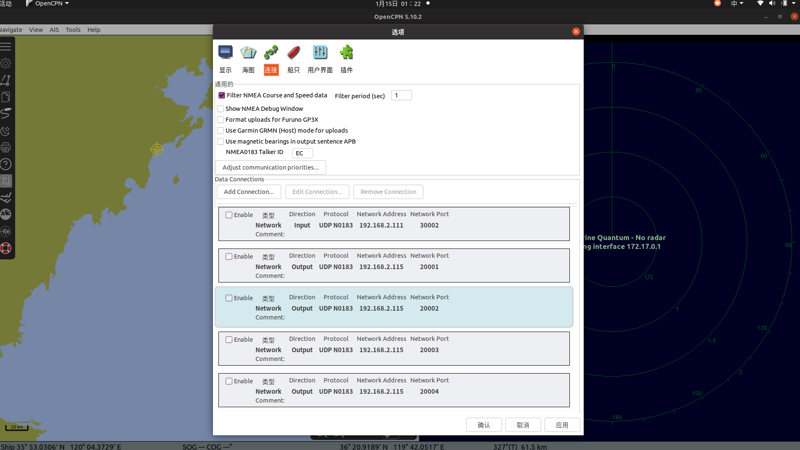
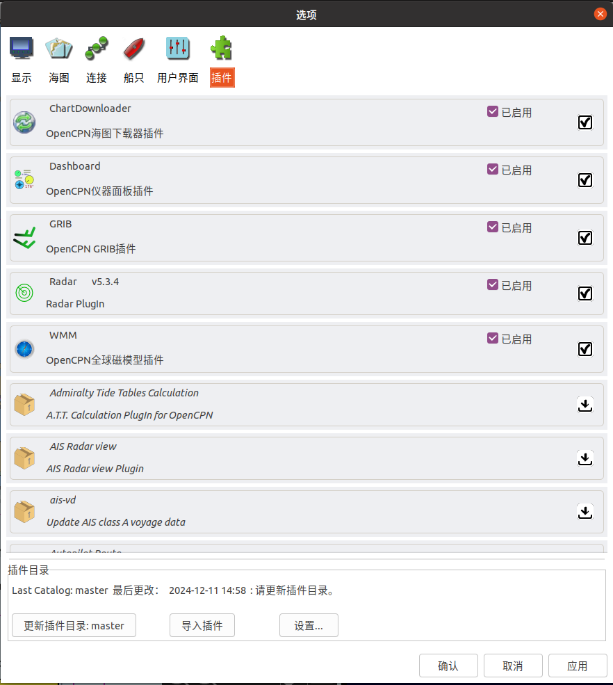

# 说明
本程序用于海康威视全景相机+RoboSense128线激光雷达+Quantum2导航雷达+海康威视双光谱云台相机+GPS，AIS，罗经，IMU等多传感器同步数据采集

#### 本程序实现了以下功能：

采集功能部分（已封装到一个launch文件中）：
1. 海康威视全景相机 四个镜头分别输出数据
2. RoboSense128线激光雷达输出数据
3. Quantum2导航雷达输出数据
4. 海康威视双光谱云台相机 两个镜头分别输出数据 云台三种运动形式(360度自动巡航，键盘控制，雷达目标检测控制)
5. IMU，GPS，AIS，罗经数据采集 其中IMU和AIS使用的是自定义的消息格式 GPS和罗经是NMEA_msg格式
6. 图像与点云的时间同步
7. 点云去NaN值

重播功能部分：
1. 可以重播压缩后的图片并显示在rviz中
2. 联合标定效果显示(效果不佳)

其他功能：
1. bag解码为jpg和pcd

#### 自定义IP与端口：(使用Wireshark可抓取)
我的电脑固定IP 192.168.2.111

全景相机 192.168.2.112:8000

热成像相机 192.168.2.113:8000

激光雷达 192.168.2.114:6699 7788

OPENCPN转发罗经，AIS，GPS，ARPA 192.168.2.115:20001 20002 20003 20004

组播：
Quantum2 224.0.0.1:5800
IMU 230.168.50.16:20000

#### 话题说明：

/hik_cam_node_1 全景相机镜头1 原始图像\
/hik_cam_node_2 全景相机镜头2 原始图像\
/hik_cam_node_3 全景相机镜头3 原始图像\
/hik_cam_node_4 全景相机镜头4 原始图像\
/compressedimg1 全景相机镜头1 压缩图像 已同步（用以采集）\
/compressedimg2 全景相机镜头2 压缩图像 已同步（用以采集）\
/compressedimg3 全景相机镜头3 压缩图像 已同步（用以采集）\
/compressedimg4 全景相机镜头4 压缩图像 已同步（用以采集）

/rslidar_points 激光雷达 原始数据\
/pointcloud 激光雷达 去NaN点云 已同步（用以采集）

/hik_cam_node_visible 双光谱相机 可见光原始图像 \
/hik_cam_node_thermal 双光谱相机 红外原始图像 \
/p2p_data 双光谱相机 全图测温原数据 \
/ptz_ctrl 双光谱相机 云台控制话题 不需要采集

/quantum_spoke 自定义雷达原始辐条数据 角度和一个250*256矩阵\
/radar_image 雷达回波图像 

/ownship 本船的信息 自定义IMU消息格式 \
/envdata 环境数据 自定义IMU消息格式 \
/nmea_sentense GPS和罗经 nmea_msgs \
/ais AIS数据 自定义AIS消息格式 

更多请看：
1. 海康威视全景相机+RoboSense128线激光雷达 <url>https://blog.csdn.net/u011549111/article/details/144158995</url>
2. Quantum2导航雷达+海康威视双光谱云台相机 \
<url>https://blog.csdn.net/u011549111/article/details/144703463?spm=1001.2014.3001.5502</url>
3. GPS，AIS，罗经，IMU（更新完毕） \
<url>[https://blog.csdn.net/u011549111/article/details/144703463?spm=1001.2014.3001.5502](https://blog.csdn.net/u011549111/article/details/145042125?spm=1001.2014.3001.5501)</url>

# 使用教程
## 编译
### 检查相机配置
在src/hikvision/launch/hik.launch和src/hikvision/launch/hik_tem.launch中更改ip等如下\
(填自己的就行)\
\<arg name="ip_addr" default="192.168.xxx.xxx"/>\
\<arg name="user_name" default="admin"/>\
\<arg name="password" default="***********"/>

### 检查雷达配置
在src/rslidar_sdk/config/config.yaml中更改雷达型号

### 检查GPS等配置
下载并安装opencpn，配置好输入输出端口。菜单栏tool/选项，然后添加网络。这里我选择192.168.2.115为输出ip，192.168.2.111是我本机的ip，作为输入ip



在src/nmea_navsat_driver/launch/nmea_socket_driver.launch和src/opencpn2ros/launch/nmea_parser.launch同样更改ip和端口为opencpn输出的端口与ip

然后再在opencpn中安装radar插件。选择更新插件目录，然后选择radar插件打钩




### 在本文件所在路径下make
```
catkin_make

使用conda的话先激活环境安装empy，再catkin_make
pip install empy==3.3.4
#这里改成你的环境路径
catkin_make -DPYTHON_EXECUTABLE=/home/li012/miniconda3/envs/ros/bin/python3 
```

到100%编译成功即可

## 运行与录制
### 运行ros
```
roscore
```

### 启动新的一个终端，用于启动传感器
```
source devel/setup.bash
roslaunch start_collect start.launch
##在弹出的rviz中可以查看同时的图像和点云数据
##使用rostopic list可以查看发布了的话题
##使用rostopic echo 话题名称 可以查看话题实时数据
##运行时可能会缺失某些python的库，按提示安装即可
```
```
##启动云台
##云台控制使用，w，a，s，d控制上下左右，空格进入巡航，再按一次退出，长按空格进入和雷达联动自动模式
roslaunch start_collect ptz_ctrl.launch
```

### 启动一个新终端，使用rosbag记录数据
```
rosbag record /pointcloud /compressedimg1  /compressedimg2  /compressedimg3  /compressedimg4 /hik_cam_node_visible/image_raw /hik_cam_node_thermal/image_raw /quantum_spoke /ownship /envdata /nmea_sentense /ais
##使用rosbag info xxx.bag 可以查看两个传感器采样频率是否对齐
```

## 回放
```
roscore
source devel/setup.bash
##必须为绝对路径
roslaunch start_collect play.launch bag_path:="/home/li012/robosense_ws/data/1208lidar/3.bag" 
```

## 解码为jpg和pcd

### 使用ros2imgAndpcd目录下的py文件完成image和点云数据的解码
conda activate ros ## 激活pyhton环境\
修改bagfile_path = './xxx.bag'和保存路径


### 附：抓取pcap
sudo tcpdump -i 网卡名 -w a.pcap -c 30000 'udp dst port 7788 or 6699' # 网卡名用ifconfig查看

# 2025.01.15 更新 OPENCPN->雷达目标检测->控制云台相机 和 GPS，AIS，罗经报文解析与储存

## GPS 罗经报文
这部分在使用了ros的开源包nmea_navsat_driver，并将launch文件改为网口数据，发送到/nmea_sentence话题

<url>http://wiki.ros.org/nmea_navsat_driver</url>

## 雷达目标检测
OPENCPN需要GPS的NMEA格式的报文以得到HDT等航海数据来产生ARPA目标，因此我需要将网口的数据让OPENCPN捕捉到。同时在OPENCPN中还需要将OPENCPN产生的数据连到网口上，配置这部分可以参考这个。（不过这个是串口，网口也类似）

<url>https://github.com/schvarcz/OpenCPN2ROS</url>

OPENCPN使用ARPA产生的目标用以下的NMEA语句表示，可参考这个

<url>https://github.com/nohal/OpenCPN/wiki/ARPA-targets-tracking-implementation</url>

然后需要解析NMEA语句，将其转为我们所需的角度，再传给云台，这部分我在opencpn2ros中实现

## AIS
AIS的NMEA数据我使用pyais库来解析并发送，在opencpn2ros中实现，发送到/ais话题

# 2025.01.13 更新 海康威视双光谱云台摄像机和IMU 消息接口

## 双光谱相机
相机图像展示部分我依旧写在了hikvison_ros中，运行hik_tem.launch即可(用start_collect start.launch也可以)，图片的在话题hik_cam_node_visible和hik_cam_node_thermal下

云台操作我都封装好了，具体控制逻辑在hik_tem/scripts的ptz_contrl.py中，我把360度自动巡航和键盘控制写了，后续会更新和Quantum2导航雷达目标检测联动的功能

启动方式依然使用

roslaunch start_collect start.launch

云台控制使用，w，a，s，d控制上下左右，空格进入巡航，再按一次退出，长按空格进入和雷达联动自动模式

roslaunch start_collect ptz_ctrl.launch 

## IMU
IMU使用的并不是普遍的串口那种，所以这里其实我只针对我们船的网口写了一个通讯协议而已，可以将网口传的数据解析并发布到自定义消息格式的话题/ownship和/envdata，存了GPS，IMU，气象仪，罗经等返回的数据。如果想研究组播通讯的可以看一看代码（但意义不大）

## 消息接口
我将所有自定义的消息都写到了message_interfaces中，这样也更加规范了

## 两个未实现的内容

第一个还是联合标定效果显示，我将参数都写好了到了程序里，但显示的结果并不好，很难对齐。初步认为是标定矩阵的问题，估计要重新来一遍。

联合显示程序运行起来还是很慢的，毕竟要把每个点云都投射上去（程序在ros_project_pc_to_image中）。本程序可以用作rosplay播放采集好数据后的参考，采集的时候就别用了。启动方式如下：

roslaunch start_collect play.launch

第二是上文说的，将Quantum2返回的数据进行一个目标检测，输出目标角度用以控制双光谱云台摄像机去拍摄。这部分我心里也不知道能不能实现，再看吧（目前是准备和OPENCPN联动，让OPENCPN去用ARPA算法检测输出NMEA数据，然后我用ROS接受NMEA数据算出角度，再发给双光谱云台。这部分应该会在opencpn2ros这个包里实现）

# 2024.12.20 更新 Quantum2雷达和一个未实现的内容

## Quantum2雷达

感谢<url>https://github.com/Aquatic-Drone-Testbed/ROS-USV-Packages</url>提供的Quantum雷达数据解析源代码，我将其改为了ROS1版本，使其集成到我们整个系统中

输出在话题/quantum_spoke中，是一个250*256的矩阵（250为辐条个数，256为每个辐条的长度），采集时依旧使用

roslaunch start_collect start.launch\
rosbag record /pointcloud /compressedimg1  /compressedimg2  /compressedimg3  /compressedimg4 /quantum_spoke

关于一些Quantum2雷达集成ROS的细节（和吐槽）我都写进了新博客<url>https://blog.csdn.net/u011549111/article/details/144703463?spm=1001.2014.3001.5502</url>，欢迎大家参考

## 一个未实现的内容

这部分主要是想实现如何将雷达数据和相机数据联合标注转换后，点云映射到图像上的效果，目前参考了<url>https://github.com/jhzhang19/ros_project_pc_to_image</url>的包，但还没有实现出来，等实现了我会提交2.2版本的

# 2024.12
开坑一个多传感器的采集系统，使用ros实现，用rosbag采集需要的话题。本次实现内容包括：
1. 海康威视全景相机 四个镜头分别输出数据
2. RoboSense128线激光雷达输出数据
3. 图像与点云的时间同步
4. 点云去NaN值
5. 重播bag包中的压缩图像
6. 封装所有节点
7. bag解析为jpg和pcd
